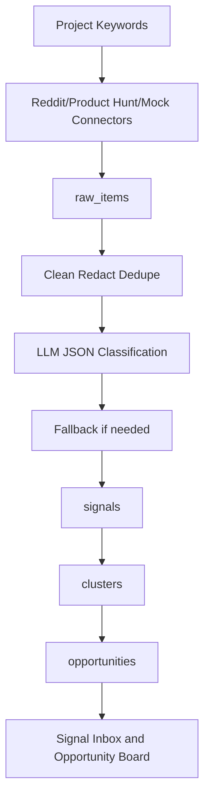

# Data Flow

Status: PHASE_1_DATA_MODEL_VALIDATED
Phase: Phase 1 Data Model

This document records the Phase 1 Data Model target flow. It does not represent final MVP acceptance.

## MVP Flow



## Phase 1 Data Model Flow

Phase 1 explicitly models the evidence path:

```text
raw_items -> signals -> clusters -> opportunities
```

- `raw_items` store normalized source evidence collected from approved platforms or demo seed data.
- `signals` represent classified demand evidence derived from `raw_items`.
- `clusters` group related `signals` for repeated pain, need, or opportunity patterns.
- `opportunities` summarize actionable product opportunities derived from `clusters`.

`source_url` is the evidence traceability baseline. Each signal must preserve a source URL so reviewers can open the original evidence when evaluating clusters and opportunities.

Product Hunt permission limits can degrade safely in later connector phases if logs are readable and mock Product Hunt data still completes the flow.

## Phase Ownership

Phase 1 implements only models, migrations, demo seed, and data validation for the flow above. Phase 2 implements the business API surface that exposes these records.
