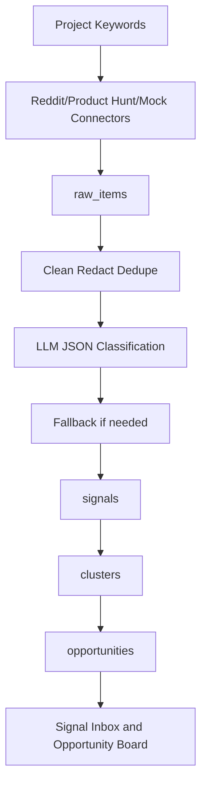

# Data Flow

Status: PHASE_4_P0_CONNECTORS_IN_IMPLEMENTATION
Phase: Phase 4 P0 Connectors

This document records the data access flow through Phase 4 P0 Connectors. It does not represent final MVP acceptance.

## MVP Flow



## Phase 1 Data Model Flow

Phase 1 explicitly models the evidence path:

```text
raw_items -> signals -> clusters -> opportunities
```

- `raw_items` store normalized source evidence collected from approved platforms or demo seed data.
- `signals` represent classified demand evidence derived from `raw_items`.
- `clusters` group related `signals` for repeated pain, need, or opportunity patterns.
- `opportunities` summarize actionable product opportunities derived from `clusters`.

`source_url` is the evidence traceability baseline. Each signal must preserve a source URL so reviewers can open the original evidence when evaluating clusters and opportunities.

Product Hunt permission limits can degrade safely in Phase 4 or later connector phases if logs are readable and mock Product Hunt data still completes the flow.

## Phase Ownership

Phase 1 implements only models, migrations, demo seed, and data validation for the flow above. Phase 2 implements the business API surface that exposes these records.

## Phase 2 API Data Flow

Phase 2 exposes the Phase 1 data model through backend APIs:

```text
projects / keywords -> API CRUD
raw_items + signals -> Signals API with source_url evidence
clusters -> Clusters API
signals or clusters -> Opportunities API
signals + clusters + opportunities -> Reports API
platform_credentials -> Settings status API without encrypted_payload
```

Collection is not active in Phase 2:

```text
POST /api/projects/{project_id}/collect -> collection_jobs(status=pending) -> collection_logs(explanatory status)
```

No connector runs in Phase 2, and no `raw_items` are created by the collect endpoint. Real connector execution begins only after Phase 4 P0 Connectors are explicitly approved.

Reports in Phase 2 are database-only exports. They must preserve `source_url` and must not include token, secret, or `encrypted_payload` fields.

## Phase 3 Connector Abstraction Flow

Phase 3 introduces connector abstraction only:

```text
POST /api/projects/{project_id}/collect
  -> connector mode validation: mock | disabled_only | safe_disabled
  -> normalized connector result
  -> collection_jobs / collection_logs status update
```

Allowed Phase 3 collection modes:

- `mock`: deterministic local connector abstraction behavior.
- `disabled_only`: explicit disabled connector response for unavailable real platforms.
- `safe_disabled`: safe degraded response without external platform calls.

Phase 3 does not create real Reddit or Product Hunt integrations. Real platform connectors are unavailable until Phase 4. Phase 5 owns the Processing Pipeline, and Phase 6 owns the Frontend MVP.

## Phase 4 P0 Connector Flow

Phase 4 adds Reddit and Product Hunt P0 connector execution while keeping CI mocked:

```text
projects / keywords
  -> POST /api/projects/{project_id}/collect
  -> execution mode: reddit | product_hunt | p0_real
  -> RedditConnector / ProductHuntConnector
  -> normalized raw items with source_url
  -> raw_items
  -> collection_logs
  -> collection_jobs status
```

Phase 4 still does not execute the Processing Pipeline:

```text
raw_items -x-> signals -x-> clusters -x-> opportunities
```

The connectors must not create `signals`, `clusters`, or `opportunities`. Phase 5 owns the Processing Pipeline, and Phase 6 owns Frontend MVP.

CI and local validation use mocked Reddit and Product Hunt responses only. Real platform smoke is local/manual only and requires `SIGNALFORGE_ALLOW_REAL_PLATFORM_SMOKE=true`. Manual smoke does not write `raw_items` unless `SIGNALFORGE_ALLOW_REAL_PLATFORM_WRITE=true` is also set.

Phase 4 connector safety rules:

- `source_url` remains mandatory for every normalized item.
- Missing tokens degrade to disabled collection logs.
- Permission limits degrade to `permission_limited` logs.
- Rate limits degrade to `rate_limited` logs.
- Reddit deleted or removed body text must not be retained.
- Product Hunt default API usage is non-commercial unless Product Hunt grants permission.
- Tokens must not appear in logs, API responses, reports, docs, or connector `raw_payload`.
- X and Discord remain unimplemented.

Phase 4 is P0 Connectors only and is not final MVP acceptance.
