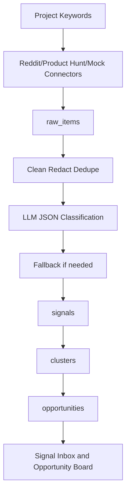

# Data Flow

Status: PHASE-1_SKELETON
Phase: Phase -1 Governance Bootstrap

This document is a skeleton and does not represent final MVP acceptance.

## MVP Flow

All signals must preserve source_url. Product Hunt permission limits can degrade safely if logs are readable and mock Product Hunt data still completes the flow.
