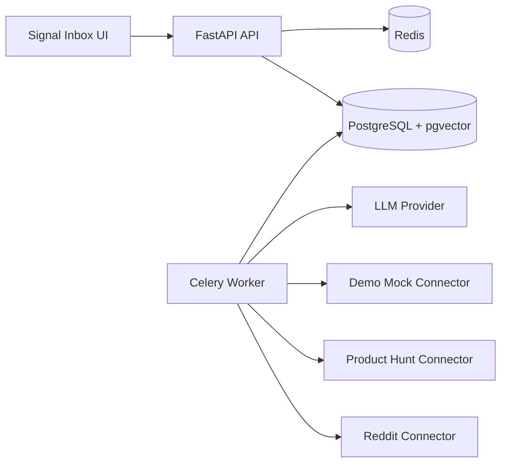

# Architecture Overview

Status: PHASE-1_SKELETON
Phase: Phase -1 Governance Bootstrap

This document is a governance skeleton and does not represent final MVP acceptance.

SignalForge is a local-first VOC Radar MVP. P0 is limited to Reddit and Product Hunt. X is P1. Discord is P2.

CI does not depend on real platform tokens. Real platform acceptance is local/manual acceptance. Product Hunt permission limits may be recorded as degraded pass when the connector fails safely and mock data still completes the pipeline.

The MVP must preserve source_url for every signal, provide a Signal Quality Gate, and support a Signal -> Cluster -> Opportunity path.

## Target System

Phase -1 does not implement these modules. Phase 0 starts infrastructure.

## Phase 0 Infrastructure Skeleton

Phase 0 adds:

- Minimal FastAPI service with `GET /health`.
- Minimal Next.js web service with a static infrastructure shell.
- PostgreSQL with pgvector extension initialization.
- Redis service.
- Docker Compose at `infra/docker-compose.yml`.
- Readiness checker at `scripts/wait_for_services.py`.

Business modules, connectors, data models, migrations, processing pipeline, and product UI are not implemented in Phase 0.
